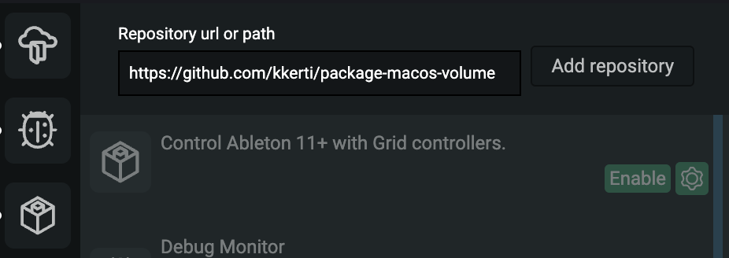

# MacOS System Volume Demo Package

This is a demo package which controls the system volume on MacOS, executing a throttled terminal command.

> [!WARNING]  
> Careful with this demo package. Sudden audio jumps may occur. Make sure you lower app volumes and avoid using headphones.

### Package structure

1. The `index.js` file is the NodeJS entrypoint of the package. There are specific hooks exported from this file which are read by the Grid Editor's package manager. In Editor, the package manager sideloads all packages in their own threads.
2. There is a **components** folder which contains the UI of the package. It is a Svelte + Vite project, built as a [web-component](https://developer.mozilla.org/en-US/docs/Web/API/Web_components).
3. There are two `package.json` files. One in the root folder, which is for the package manager to read the package metadata and also for any NodeJS only _backend_ npm packages. The other is in the components folder, which is for the Svelte + Vite project, where you can install _client-side_ npm packages.

### How to develop

1. Clone the repo to `grid-userdate/packages`, which is under your user's documents folder.

2. After cloning the repo, run `npm install` in **both** the root and components folder.

```sh
npm install # in the root folder
cd components && npm install
```

3. Build the package by running `npm run build` in the root folder, this builds both the webcomponent and the package itself.

4. Open Grid Editor, go to the Package Manager and enable the package. The package **must be built first**, before it can be used in the Editor.

5. After you make code changes, the package must be rebuilt and _sometimes_ the package manager restarted to see the changes.

6. Current advise is to clone the Grid Editor app as well, and open both the Editor and the package in your code editor. As of today in Editor version 1.6.0, the logs of the package is only visible when you run the Editor from source and look at the terminal logs.

## Know-how

To release a package be able to share it with others, you need to build a zip package from it. It's best to do that based on the `.github/workflows/main.yml` file.



You will need to enable the workflow to write packages on your repository in the Github settings menu.


...
